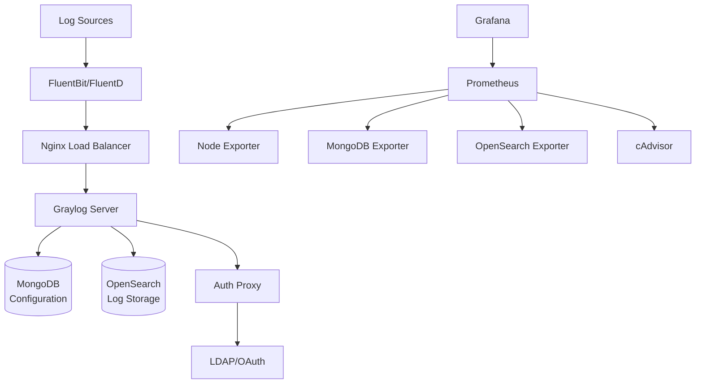

# Qubership External Logging Installer

An Ansible-based automation tool for deploying a complete enterprise logging infrastructure stack powered by Graylog. This installer provides a comprehensive solution for centralized log collection, processing, storage, and visualization on virtual machines.

[](https://github.com/Netcracker/qubership-external-logging-installer/actions/workflows/super-linter.yaml)
[](https://github.com/Netcracker/qubership-external-logging-installer/releases)

## Table of Contents

<!-- toc -->

## Features

- **Complete logging stack deployment** with Graylog, OpenSearch, and MongoDB
- **Automated SSL/TLS certificate management** for secure communications
- **Multi-protocol log ingestion** supporting Syslog, GELF, and container logs
- **Built-in monitoring** with Prometheus exporters for all components
- **Load balancing and high availability** with Nginx and Keepalived support
- **Log processing pipelines** with FluentBit and Fluentd integration
- **Authentication proxy** for enterprise LDAP/OAuth integration
- **Pre-configured dashboards** and extractors for common log formats
- **Scalable architecture** supporting 1K-25K+ messages per second
- **Cross-platform support** for Ubuntu, CentOS, RHEL, and Rocky Linux

## Requirements

### Supported Operating Systems
- **Ubuntu:** 22.04 LTS (recommended), 20.04 LTS
- **RHEL-based:** CentOS 8.x, RHEL 8.x, Oracle Linux 8.x, Rocky Linux 8.6+, 9.2+
- **Cloud:** Amazon Linux 2

### Hardware Requirements
- **CPU:** 4+ vCPU (12+ for high throughput)
- **RAM:** 8+ GB (24+ GB for high throughput)
- **Storage:** 1000+ IOPS, SSD recommended
- **Network:** Opened ports 22, 80, 443, 514, 12201, 12202

### Software Requirements
- Docker >= 20.x
- Python 3.x with pip
- Ansible (installed via requirements)
- Additional packages: `acl`, `zip`, `unzip`, `net-tools`

## Installation

### Quick Start

1. **Clone the repository:**
   ```bash
   git clone https://github.com/Netcracker/qubership-external-logging-installer.git
   cd qubership-external-logging-installer
   ```

2. **Install Ansible dependencies:**
   ```bash
   pip3 install ansible
   ```

3. **Configure your inventory:**
   ```bash
   # Create inventory file with your target hosts and parameters
   cat > inventory.yml << 'EOF'
   all:
     hosts:
       your-server-ip:
         ansible_user: ubuntu
     vars:
       graylog_install: true
   EOF
   ```

   **Important:** Edit `inventory.yml` with your actual server IP and required configuration parameters. See the [Installation Guide](docs/installation.md) for detailed configuration options and examples.

4. **Run the playbook:**
   ```bash
   ansible-playbook -i inventory.yml playbooks/playbook.yaml
   ```

### Advanced Installation

For detailed installation instructions, hardware sizing, and configuration options, see the [Installation Guide](docs/installation.md).

## Usage

### Basic Operations

After installation, access the Graylog web interface at `https://your-server/` using the configured credentials.

**Send test logs:**
```bash
# Syslog UDP
logger -n your-server -P 514 "Test log message"

# GELF TCP
echo '{"version":"1.1","host":"test","short_message":"Hello Graylog"}' | nc your-server 12201
```

**Monitor system health:**
```bash
# Check service status
ansible-playbook -i inventory.yml playbooks/playbook.yaml --tags health_check

# View logs
docker logs graylog
```

## Configuration

### Key Configuration Parameters

| Parameter | Description | Default |
|-----------|-------------|---------|
| `graylog_image` | Graylog Docker image | `graylog/graylog:5.2.9` |
| `opensearch_heap_size` | OpenSearch JVM heap | `2g` |
| `mongodb_version` | MongoDB version | `4.4` |
| `nginx_ssl_enabled` | Enable SSL/TLS | `true` |

### Environment-Specific Settings

**Development:**
```yaml
all:
  vars:
    graylog_environment: development
    check_prerequisites_enabled: false
```

**Production:**
```yaml
all:
  vars:
    graylog_environment: production
    ssl_certificates_enabled: true
    backup_retention_days: 30
```

For complete configuration reference, see [docs/installation.md](docs/installation.md).

## Documentation

- [📖 Installation Guide](docs/installation.md) - Complete installation and configuration reference
- [🔐 MongoDB Authentication](docs/mongodb_authentication.md) - Database security setup
- [🔍 Observability](docs/observability.md) - Monitoring and metrics configuration
- [🔑 Password Change Guide](docs/password-change-guide.md) - Security management

## Architecture

### System Overview



The architecture consists of:
- **Data Plane:** FluentBit/FluentD collectors → Nginx proxy → Graylog processing → OpenSearch storage
- **Control Plane:** MongoDB for configuration, Auth Proxy for authentication
- **Monitoring:** Prometheus exporters feeding into Grafana dashboards

## Testing

### Automated Testing

The project includes automated linting and validation:

```bash
# Run Super Linter (same as CI)
docker run --rm -e RUN_LOCAL=true -v $(pwd):/tmp/lint github/super-linter:latest

# Ansible syntax check
ansible-playbook --syntax-check playbooks/playbook.yaml

# Dry run deployment
ansible-playbook -i inventory.yml playbooks/playbook.yaml --check
```

### Manual Testing

```bash
# Verify all services are running
docker ps

# Test log ingestion
logger -n localhost -P 514 "Test message from $(hostname)"

# Check Graylog API
curl -k https://localhost/api/system/cluster/nodes
```

## Contributing

We welcome contributions! Please follow these steps:

1. Sign the [Contributor License Agreement](https://pages.netcracker.com/cla-main.html)
2. Read the [Code of Conduct](CODE-OF-CONDUCT.md)
3. Fork the repository and create a feature branch
4. Make your changes and ensure tests pass
5. Submit a pull request with a clear description

For detailed contribution guidelines, see [CONTRIBUTING.md](CONTRIBUTING.md).

## License

This project is licensed under the Apache License 2.0 - see the [LICENSE](LICENSE) file for details.
