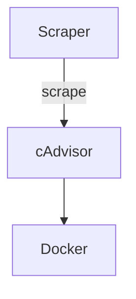

# cAdvisor

This role deploys:

* [cAdvisor](https://github.com/google/cadvisor) - collects Docker metrics

Parameters are described in the ["Installation guide"](/docs/installation.md#cadvisor)

```mermaid
graph TD;
  Scraper-->|scrape|cAdvisor;
  cAdvisor-->Docker;
```
