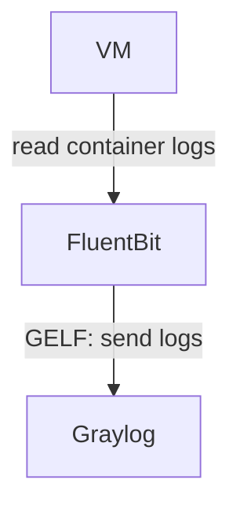

# FluentBit

This role deploys:

* [FluentBit](https://fluentbit.io) - collect self logs from containers on the VM

Parameters are described in the ["Installation guide"](/docs/installation.md#fluentbit)

