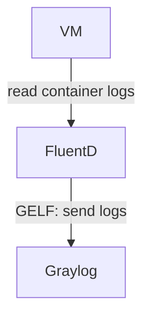

# FluentD

This role deploys:

* [FluentD](https://www.fluentd.org/) - collect self logs from containers on the VM

Parameters are described in the ["Installation guide"](/docs/installation.md#fluentd)

